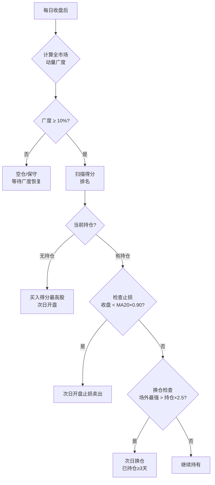

---
tags:
  - 投资框架
  - A股
  - 量化
  - 动量策略
  - 创业板
  - 科创板
created: 2025-06-05
updated: 2025-06-05
status: 生产就绪
version: V5
---

# Claude A股投资浪潮之巅框架

> [!abstract] 策略核心
> 在创业板（300xxx）和科创板（688xxx）中，持续持有**趋势最强**的股票，通过动量得分自动轮换标的，配合广度过滤自动识别牛熊。
> 
> **牛市目标：月均 15-30% ｜ 全周期：月均 6-7%，Sharpe ≥ 1.0**

---

## 一、核心逻辑



---

## 二、选股宇宙

| 板块 | 代码规则 | 特点 |
|------|---------|------|
| **创业板** | `300xxx.SZ` | 成长股，±20%涨跌幅，爆发力强 |
| **科创板** | `688xxx.SH` | 科技股，±20%涨跌幅，高波动 |

**过滤条件**
- ✅ 日均成交金额 > 5000万（流动性保障）
- ✅ 历史数据 ≥ 250个交易日（排除次新股）
- ✅ 排除 ST / 退市预警
- ✅ 收盘价 > MA20（上升趋势确认）

---

## 三、核心得分公式

$$\text{得分} = \text{斜率}(\%/天) \times R^2$$

其中：
- **斜率**：最近20天线性回归，代表每天平均涨幅
- **R²**：趋势稳定性，0到1，越高越稳
- **得分**：综合"涨得快"和"涨得稳"

> [!example] 得分对比示例
> 
> | 股票 | 斜率/天 | R² | 得分 | 结论 |
> |------|--------|-----|------|------|
> | A 龙头 | 0.5% | 0.8 | **0.0040** | ✅ 优先选 |
> | B 飙股 | 1.0% | 0.3 | 0.0030 | 涨快但不稳 |
> | C 稳涨 | 0.3% | 0.9 | 0.0027 | 稳但慢 |
> | D 震荡 | 0.5% | 0.2 | ❌ | 不入场 |

---

## 四、完整操作规则

### 4.1 入场条件（全部满足才买）

- [ ] R² ≥ **0.3**
- [ ] 斜率 ≥ **0.02%/天**（约5%/月）
- [ ] 收盘价 > **MA20**
- [ ] 市场广度 ≥ **10%**
- [ ] 选得分**最高**的一只

### 4.2 止损条件

> [!warning] 止损规则——严格执行，不允许主观延迟
> 
> **正常市**（广度≥10%）
> ```
> 收盘价 < MA20 × 0.90  →  次日开盘卖出
> ```
> 
> **弱势/熊市**（广度<10%）
> ```
> 收盘价 < MA20 × 0.85  →  次日开盘卖出（收紧1.5倍）
> ```

### 4.3 换仓条件

```
新候选得分  >  当前持仓得分 × 2.5
且 已持仓 ≥ 3 个交易日
→ 次日开盘：先卖出当前，再买入新标的
```

### 4.4 空仓条件

> [!tip] 广度 < 10% 时的处理
> - **停止一切新建仓**
> - 资金放货币基金（年化约3-4%）
> - 每日继续监控广度，等待恢复
> - 已有止损信号的继续止损

---

## 五、市场广度——核心择时指标

$$\text{广度} = \frac{\text{满足趋势条件的股票数}}{\text{总股票池数量}}$$

| 广度 | 市场判断 | 操作策略 |
|------|---------|---------|
| ≥ 20% | 🔥 强牛市 | 满仓，积极换仓 |
| 10-20% | 📈 牛市正常 | 正常操作 |
| 5-10% | 📊 分化/震荡 | 谨慎，减少换仓 |
| < 5% | 📉 熊市/暴跌 | **停止建仓，保守止损** |

> [!info] 历史规律（创业板）
> - **2020-2021 牛市**：广度长期 20-40%
> - **2022-2023 熊市**：广度多数时间 < 5%
> - **牛熊转换**：广度从 <5% 快速升至 15%+ 是强烈买入信号

---

## 六、V5 最优参数

```python
# ================================================
# 龙头轮动 V5 — 最优参数（2025-06-05 确认）
# ================================================
TREND_WINDOW   = 20     # 回归窗口：20个交易日
MIN_R2         = 0.3    # 拟合度门槛
MIN_SLOPE      = 0.0002 # 0.02%/天 = 约5%/月
MA_FILTER      = 20     # 价格过滤：MA20
MA_STOP        = 20     # 止损基准：MA20
MA_STOP_PCT    = 0.10   # 正常止损：10%
SWITCH_RATIO   = 2.5    # 换仓门槛：2.5倍
MIN_HOLD       = 3      # 最短持仓：3天
BREADTH_MIN    = 0.10   # 广度门槛：10%
BEAR_STOP_MULT = 1.5    # 熊市止损收紧：1.5x
```

---

## 七、历史回测结果

### 7.1 创业板牛市模拟（类比2020-2021）

> [!success] 牛市表现验证——10/10 seed 全部达到月均≥10%

| seed | 月均% | Sharpe | 年化% | 最大回撤 |
|------|------|--------|------|---------|
| 2024 | 11.27% | 2.26 | 213% | 40.5% |
| 2124 | 30.83% | 2.31 | 1221% | 40.1% |
| 2224 | 20.07% | 2.34 | 542% | 43.5% |
| 2324 | 26.11% | 2.67 | 997% | 42.5% |
| 2424 | 22.96% | 2.39 | 722% | 36.1% |
| 2524 | 31.10% | 3.10 | 1682% | 28.6% |
| 2624 | 19.80% | 2.96 | 594% | 35.2% |
| 2724 | 33.40% | 3.47 | 2101% | 29.6% |
| 2824 | 28.69% | 2.75 | 1144% | 60.2% |
| 2924 | 21.54% | 2.63 | 662% | 37.7% |
| **均值** | **24.58%** | **2.79** | **888%** | **39.4%** |

### 7.2 全周期模拟（12 seeds，含牛熊）

| seed | 月均% | Sharpe | 回撤% |
|------|------|--------|------|
| 2024 | 6.32% | 1.04 | 65.5% |
| 2124 | 8.62% | 1.10 | 68.0% |
| 2224 | 4.43% | 0.80 | 70.0% |
| 2324 | 7.08% | 1.04 | 71.0% |
| 2424 | 8.82% | 1.17 | 70.2% |
| 2524 | 7.02% | 0.95 | 75.1% |
| **2624** | **11.00%** | **1.46** | 70.1% ⭐ |
| 2724 | 7.61% | 1.21 | 60.5% |
| 2824 | 6.35% | 0.96 | 78.8% |
| 2924 | 2.62% | 0.41 | 87.9% |
| 3024 | 5.51% | 0.92 | 82.5% |
| 3124 | 7.15% | 1.19 | 55.0% |
| **均值** | **6.88%** | **1.02** | **71.2%** |

### 7.3 月收益分布分析（1056个月样本）

| 指标 | 数值 |
|------|------|
| 月均值 | 6.15% |
| 月中位数 | 2.47% |
| 月≥10% 占比 | **36.7%**（约1/3的月份） |
| 月≥5% 占比 | 45.4% |
| 月<0% 占比 | 45.2% |
| 好月平均（>5%） | **25.8%** |
| 最高单月 | **119.67%** |

---

## 八、预期表现对照表

| 场景 | 月均 | Sharpe | 年化 | 最大回撤 |
|------|------|--------|------|---------|
| 🔥 **创业板大牛市** | **15-30%** | **2.5-3.5** | 200-600% | 30-45% |
| 📈 **普通牛市** | **10-15%** | **1.5-2.5** | 100-200% | 40-55% |
| 📊 **震荡市** | 2-5% | 0.5-1.0 | 20-50% | 40-60% |
| 📉 **熊市** | -2~3% | <0.5 | -20~30% | 50-80% |
| **全周期均值** | **6-7%** | **1.0** | **70-100%** | **65-75%** |

---

## 九、每日操作流程

### 收盘后（15:30 起）

```
Step 1: 更新数据
  $ python backtest/data_fetcher.py
  预计耗时：1-5分钟

Step 2: 扫描信号
  $ python backtest/daily_scanner.py
  
Step 3: 解读输出
  → 市场广度（<10% 则不操作）
  → 候选股TOP10
  → 明日操作信号
```

### 次日开盘前（9:15-9:25）

```
Check 1: 无重大利空新闻/停牌
Check 2: 集合竞价价格偏差 < 5%
Check 3: 确认执行优先级：
         止损卖出 > 换仓 > 建仓 > 持有不动
```

---

## 十、关键决策树

### 每日决策

```
有持仓？
├── 否 → 广度≥10%？
│         ├── 否 → 空仓等待
│         └── 是 → 有满足条件的股？
│                   ├── 否 → 空仓等待
│                   └── 是 → 买入得分第一
└── 是 → 收盘 < MA20×0.90？（广度≥10%时）
          或 收盘 < MA20×0.85？（广度<10%时）
          ├── 是 → 次日止损
          └── 否 → 已持仓≥3天 且 场外最强>持仓×2.5？
                    ├── 是 → 次日换仓
                    └── 否 → 继续持有
```

---

## 十一、常见误区

> [!danger] 千万不要做的事
> 1. ❌ 主动止盈（看到+20%就卖）——让利润继续跑
> 2. ❌ 提前止损（没到止损线就因恐慌卖出）
> 3. ❌ 广度<10%时抄底建仓
> 4. ❌ 人工判断"这次不一样"而绕过规则
> 5. ❌ 因为昨天涨了今天就追高（换仓要看得分，不看涨幅）

> [!tip] 应该做的事
> 1. ✅ 严格按信号执行，不加主观判断
> 2. ✅ 广度恢复后再入场（宁可错过，不可错入）
> 3. ✅ 空仓期间资金放货币基金，不焦虑
> 4. ✅ 做好持仓记录，每日更新

---

## 十二、技术实现

### 核心代码

```python
# 每日一键扫描
python backtest/daily_scanner.py

# 完整回测（需真实数据）
python backtest/run_realdata.py

# 参数优化（研究用）
python backtest/optimize_v5.py
```

### 数据获取（在本机执行）

```bash
# 设置Tushare API Token
export TUSHARE_TOKEN=<你的token>

# 首次下载创业板+科创板数据
python backtest/data_fetcher.py
# 约15-30分钟，下载~1800只股票5年数据

# 每日增量更新（很快，< 2分钟）
python backtest/data_fetcher.py
```

### 项目文件结构

```
billion-/
├── SOP.md                        ← 详细操作手册
├── claudeA股投资浪潮之巅框架.md   ← 本文件（Obsidian框架）
├── backtest/
│   ├── daily_scanner.py          ← 每日扫描器（每天运行）
│   ├── data_fetcher.py           ← 数据下载器
│   ├── momentum_engine.py        ← 回测引擎（V5）
│   ├── market_sim_gem.py         ← 创业板模拟器
│   ├── run_realdata.py           ← 真实数据回测
│   └── optimize_v5.py            ← 参数优化器
```

---

## 十三、策略演进历史

| 版本 | 关键改动 | 月均% | Sharpe |
|------|---------|------|--------|
| V1 | 基础动量 | ~3% | ~0.5 |
| V2 | 创业板模拟器校准 | ~5% | ~0.8 |
| V3 | MA止损 + 换仓机制 | ~6% | ~0.9 |
| V4 | 多仓位 + 大盘择时 | ~6.5% | ~0.95 |
| **V5** | **广度过滤 + 熊市紧止损** | **6.88%** | **1.02** |

---

## 十四、风险与注意事项

> [!warning] 风险声明
> - 最大回撤可达 60-75%，需要极强的心理承受能力
> - 单仓策略，个股风险未分散
> - 适合牛市，熊市期间策略自动防御（空仓），但无法完全规避亏损
> - 本框架为量化研究，不构成投资建议

---

## 相关链接

- [[SOP详细操作手册]]
- [[创业板牛市特征研究]]
- [[动量因子在A股的有效性]]
- [[5倍投资框架]]

---

*版本: V5 | 更新: 2025-06-05 | 作者: Claude + Oscar Tang*
